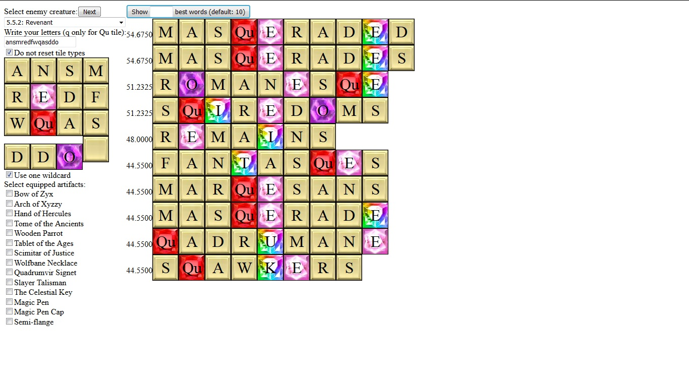

# Bookworm Assistant

Assistant helping in playing Bookworm Adventures Deluxe (both Volume 1 and Volume 2).

Build: `stack build`

Run: `stack exec bookworm-assistant`, then enter `localhost:8023` in your browser.

## How to use this tool?

### 1. Select the enemy

In the left top corner there is a drop-down list from which you can select your current enemy.

This has two purposes:
* many creatures have bonus words associated with them; the algorithm takes that into consideration,
* sets of words used by both games slightly differ.

To save a few clicks, there is a button that selects `Next` enemy.

### 2. Insert letters

A few tips:
* to use `Qu` tile, write `q` letter only,
* clicking on tiles lets you switch type of tile. Available tile types are:
    * basic tile type,
    * all gems,
    * smashed tile, representing all negative ailments (in all cases letter has no value).

  Right clicking on a tile reverts it to basic type.

  If you have locked (unusable) tile, just don't write it.

  If you have wildcard tile, select checkbox under grid instead of writing any character.
* By default, modifying input wipes out all tile types. This is usually intended behavior,
  since you use many tiles. In some cases (i. e. scramble), it would be better
  to keep them. To do so, select checkbox "Do not reset tile types" right above the grid.

### 3. Select artifacts

Note that not all artifacts are here, only those which can alter your choice.
MacFarmer's Almanac and Master's Zodiac are not implemented.

### 4. Find the best words

Score on the left is estimated base damage of the word. This number can be very inaccurate.
The algorithms calculating scores use only publicly available information
(mostly `readme.html` files in both volumes), my own guesses or information provided on
[Bookworm Adventures Wiki](https://bookwormadvs.fandom.com/wiki).
To find exact algorithms, one would have to decompile Lua files.

## Structure of the project

Source code: `app` and `src` directories

GUI was created using `threepenny-gui`.

All images, lists of all words, words from bonus categories, and bonus words for each creature and chapter
were extracted from source files (file [main.pak](https://bookwormadvs.fandom.com/wiki/Extract_main.pak))
using [strings](https://linux.die.net/man/1/strings). This means that some 3-letter words were omitted,
since this tool requires at least 4 characters to notice a string.

Compression of lists of all words is described [here](https://bookwormadvs.fandom.com/wiki/Main.pak/compressed.txt). Decompressor (`stack exec decompressor`) was used to get lists of all words.

File `creatures.txt` describes all creatures and their bonus words:
* each chapter begins with line `X.Y` denoting chapter number,
* what follows next is list of bonus words for all creatures in chapter,
* then each creature from the chapter is written (exclamation mark and name),
* each creature might have own bonus words.

Bonus words in file are either category pointers (starting with `@`,
i. e. `@Fire` means "all words from `fire.txt`") or just a word.

Note that BWA1 is glitched and bonus chapter/creature words don't work.